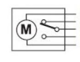
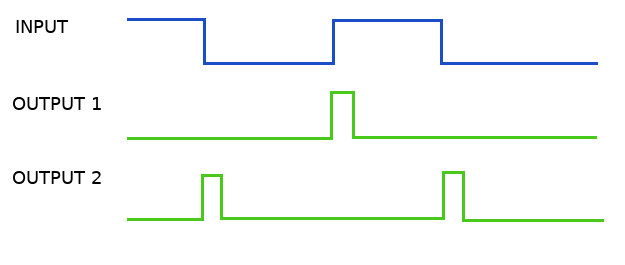
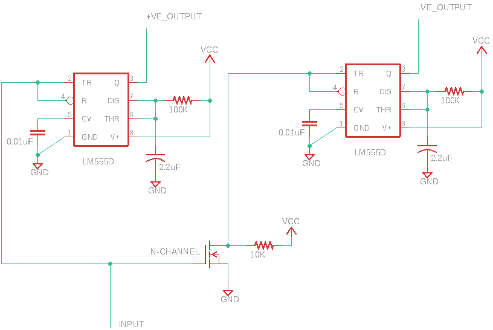

## __Edge detection using 555 timer__

This circuit is used to generate variable width pulses on two outputs in response to change in input signal.(Refer to the timing diagram below)\
The pulse length of positive edge and negative can be independelty adjusted by changing the 100K resistor or/and 2.2uF capacitor (1.1RC).\
This circuit can also be made using AND gate with delayed inputs.

Some information about car locking mechanism.

> There are various way to lock/unlock a car like using keyfob, button controls on the driver side and by physically moving the lock position on the doors.
Here we are intrested in locking/unlocking by physically moving the locking mechanism on the doors, if you notice carefully all doors except the driver can independently lock/unlock their doors but when the driver locks/unlocks the door all other doors follow the same. As long as the car supports this feature you could do this trick in the car.

The actuator on the driver side has 5 wires instead of 2, the other 3 wires are two microswitches that provide the ECU with the position of the locking mechanism. We will refer to the 2 solenoid/motor wires as actuator wires and the other 3 wires as feedback wires.

### Internal wiring

We have two options:-
* (Method 1) We can simply apply voltage to the actuator wires in required polarity to lock and unlock the mechanism, tricking the car into thinking that someone has pulled or pushed the lock.
* (Method 2) We can simply control the feedback signals and give the car whatever signal we want. 

Method 1 
Engages only when required
Needs power powers

Full time active system
only signals wiring is required

> This was used to lock and unlock the cars by triggering the driver side actuator, doing this tricks the ECU in thinking that someone has physically opened/closed the doorlock.    

:thumbsup:
:thumbsdown:

## Timing

## Circuit Design

____________________________________________________________________________________________________

