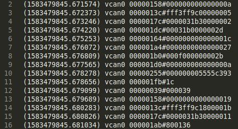

### Getting Started with CAN reader

ESP32 with SN65HVD230(CAN Transceiver) and a **pull-up resistor** is used.\
The ESP32 with the SN65HVD230 should have been enough (according to many sources on the internet).\
I was only able to read packets using this but not write packets to the network.\
Then i came across this [guide](http://www.ti.com/lit/an/slyt529/slyt529.pdf) and tried using pull-up resistors, the resistor was needed to be connected on Tx if the micro-controller
has open-drain pins.(using pull-up on RX did it for me).

To upload code in ESP32, First [setup ESP-IDF](https://docs.espressif.com/projects/esp-idf/en/latest/esp32/get-started/), now either copy the code or replace the file in the directory where you area working.

* Use "can_baudrate_finder.c" to find the baudrate.(It is usually 500Kbps)
* Change baudrate in can_listener.c and upload "can_listener.c".
* Now check which port has been assigned to ESP32, its usually /dev/ttyUSB* or /dev/ttyACM* in linux.
* "python3 can_reader.py port_name"

Check "vcan.log", it should look like this.\

This file is almost compatible with socketcan library provided in linux.

(1583479945.930337) vcan0 00000164#000000000000003a\
00000164 is the CAN ID of 29-Bits, make it 11-Bits by removing 5 zeros\
(1583479945.930337) vcan0 164#000000000000003a    (This can be used with any socketcan fucntion)

__________________________________________________________________________________________________________________________________________________________

### CAN packet Tx
Flash "can_sender.c" to send messages on the CAN bus.\
When using this mode the ESP32 needs inputs via a serial console like putty.

        Header(h):      00000000-1FFFFFFF (Flag dependent)
        DLC(l):         0-8 
        Tx Delay(t):    0000-9999ms (*Use 4 Digits)
        Body(b):        00-ff
        Flag(f):        1-5  None/Ext/SS/RTR/NO_DLC
        Send(s):        1(Stop)-2(One packet)-3(Continous).  *SS is different

__________________________________________________________________________________________________________________________________________________________

