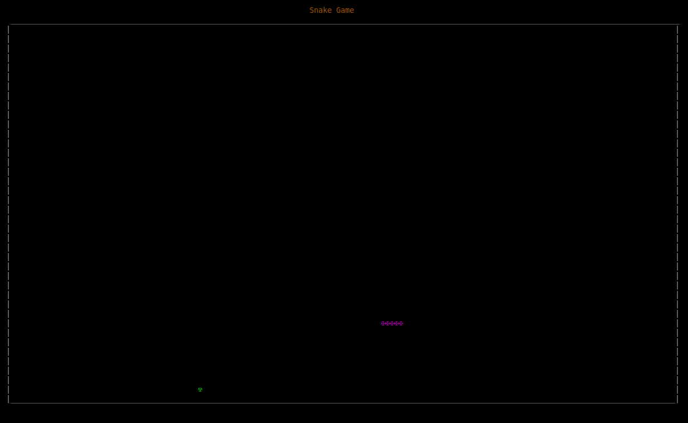
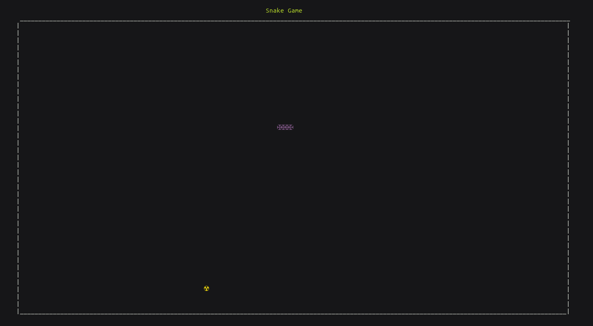

## __SNAKE GAME (TERMINAL)__

This game is an easy to learn program which can help you get started with the visual text maniulations available in the terminal using unicodes and escape sequences, it will also include SIGTERM (It is advised that you familiarise yourelf with linux signals). 

_Modifications required_

* Input is taken from /dev/input/event* which makes it impossible to run on windows machines and requires changing the event and keymaps on certain linux machines by modifying this function.

```
void *get_keyboard() 
{
	struct input_keyboard key;
	__uint32_t keyboard_file =open("/dev/input/event3",O_RDONLY);
	while(1)
	{
		read(keyboard_file,&key,__sizeof(key));	 
		if(key.type==1) //type 1 is for state change of keyboard -----  value  0-released,1-pressed,2-held 
		{ 
			if(key.code==103||key.code==105||key.code==106||key.code==108)
				{
                    button=key.code;
                }
		}
	}
}
```

It also requires superuser access in order to access the /dev/input files.

* Game end in not handled properly, the terminal should close the game screen and then show some message which should disappear after pressing a key.
* Though this game is good to learn Unicodes and escape sequences, but they should be avoided as thier behaviour/appereance changes from terminal 
to terminal.  
* This screen resolution can affect how the game looks, in order to fix this grep the screen resolution and make the game according to scale, currently it acts as if display is 1920x1080.

You can see below how the same code generates different results on the same laptop after changing the OS from Linux Mint to POP OS.

- [ ] working 
- [x] not working 

Linux Mint


POP OS



___________________________________________________________________________
